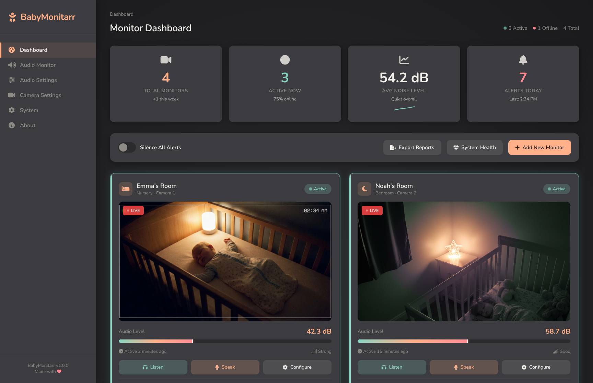
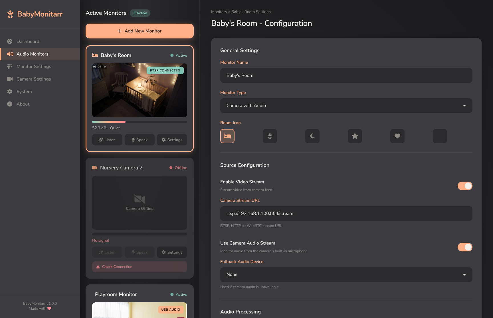
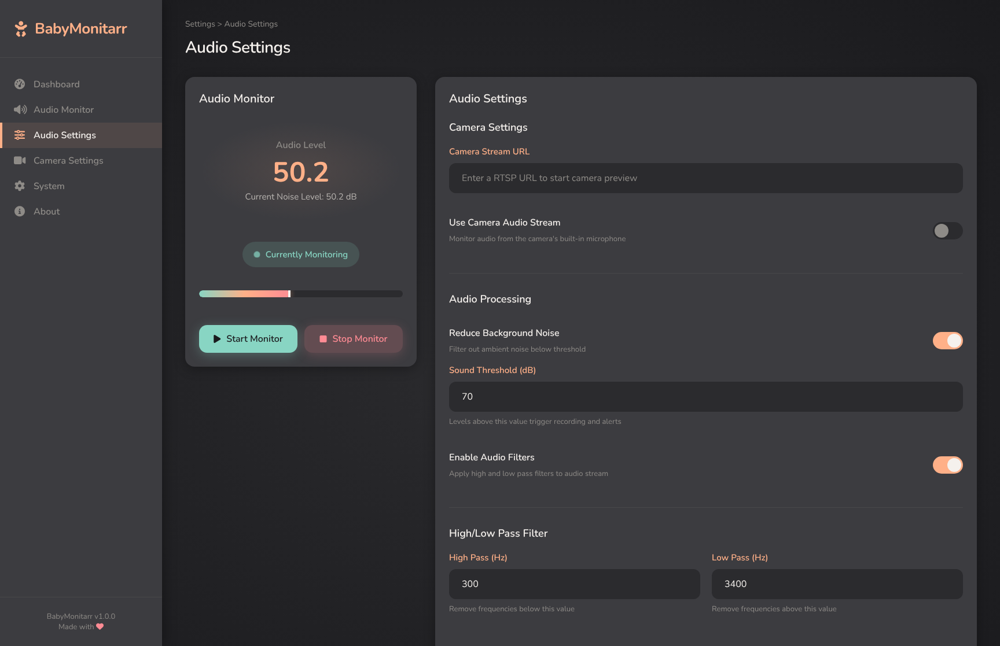

<p align="center">
  
</p>

<h1 align="center">BabyMonitarr</h1>

<p align="center">
  <strong>A self-hosted, real-time baby monitor for your IP cameras and microphones.</strong>
  <br />
  Stream audio and video from any RTSP camera or Google Nest device straight to your browser — no cloud (except Google Nest if you use it), no subscriptions, no latency.
</p>

<p align="center">
  <a href="#quick-start">Quick Start</a> •
  <a href="#features">Features</a> •
  <a href="#screenshots">Screenshots</a> •
  <a href="#configuration">Configuration</a> •
  <a href="#google-nest-setup">Nest Setup</a> •
  <a href="#contributing">Contributing</a>
</p>

---

## Why BabyMonitarr?

Most baby monitors are either expensive proprietary hardware, cloud-dependent apps with monthly fees, or laggy phone-based solutions. If you already have an IP camera (or a Google Nest), you shouldn't need any of that.

BabyMonitarr turns your existing cameras into a low-latency, privacy-first baby monitor you can access from any browser on your network. It uses **WebRTC** for near-instant peer-to-peer streaming — the same technology behind video calls — so audio reaches you in milliseconds, not seconds.

**No data leaves your network. No accounts required. No subscriptions. Ever.**

## Features

- **Multi-Room Monitoring** — Set up as many rooms as you need, each with its own camera and settings. See them all at a glance from the dashboard.
- **Low-Latency Audio & Video** — WebRTC peer-to-peer streaming with Opus audio. Hear your baby the moment they stir, not 5 seconds later.
- **Sound Detection & Alerts** — Configurable audio threshold alerts tell you when noise exceeds a level you set. No more staring at a screen waiting.
- **RTSP Camera Support** — Works with virtually any IP camera, DVR, or NVR that supports RTSP or HTTP streams.
- **Google Nest Integration** — Connect your Nest cameras via the Smart Device Management API with built-in OAuth setup.
- **Audio Filtering** — Built-in high-pass and low-pass filters let you cut out background noise like fans or air conditioners.
- **Real-Time Audio Level Meter** — Live dB visualization so you can see activity at a glance.
- **Volume Control** — Adjustable volume boost/reduction (-20 to +20 dB) per stream.
- **Docker Ready** — One container, one volume. Up and running in under a minute.
- **Privacy First** — Fully self-hosted. SQLite database. Nothing phones home.

## Screenshots

| Dashboard | Camera Configuration | Audio Settings |
|:-:|:-:|:-:|
|  |  |  |

## Quick Start

### Docker (Recommended)

```bash
docker run -d \
  --name babymonitarr \
  -p 8080:8080 \
  -v babymonitarr-data:/app/data \
  ghcr.io/inrego/babymonitarr:latest
```

Then open [http://localhost:8080](http://localhost:8080) in your browser.

### Docker Compose

```yaml
services:
  babymonitarr:
    image: ghcr.io/inrego/babymonitarr:latest
    container_name: babymonitarr
    ports:
      - "8080:8080"
    volumes:
      - babymonitarr-data:/app/data
    restart: unless-stopped

volumes:
  babymonitarr-data:
```

### Build from Source

Requires [.NET 9 SDK](https://dotnet.microsoft.com/download/dotnet/9.0) and FFmpeg.

```bash
git clone https://github.com/your-username/BabyMonitarr.git
cd BabyMonitarr/BabyMonitarr.Backend
dotnet restore
dotnet run
```

## Configuration

All settings are managed through the web UI — no config files to edit.

### Adding a Monitor

1. Open the **Monitors** page
2. Click **Add Room** and give it a name and icon
3. Choose your source type:
   - **RTSP Camera** — Enter your camera's stream URL (e.g., `rtsp://192.168.1.100:554/stream`)
   - **Google Nest** — Select a linked Nest device (see [Nest Setup](#google-nest-setup))
4. Enable audio and/or video streaming
5. Adjust sound threshold, filters, and volume to your liking
6. Save — your monitor appears on the dashboard

### Audio Settings

| Setting | Description |
|---------|-------------|
| Sound Threshold | dB level that triggers an alert (default: -20 dB) |
| Audio Filters | High-pass / low-pass filters to remove background noise |
| Volume Adjustment | Boost or reduce stream volume (-20 to +20 dB) |
| Alert Cooldown | Pause between repeated alerts (default: 30s) |

## Google Nest Setup

To use Google Nest cameras, you'll need OAuth 2.0 credentials from the [Google Cloud Console](https://console.cloud.google.com/) for the Smart Device Management (SDM) API.

1. Create a project in the Google Cloud Console and enable the SDM API
2. Set up OAuth 2.0 credentials with the redirect URI:
   ```
   http://localhost:8080/nest/auth/callback
   ```
   *(Replace `localhost:8080` with your actual host if needed)*
3. In BabyMonitarr, go to **System** → enter your Client ID, Client Secret, and Project ID
4. Click **Link Account** and complete the Google OAuth flow
5. Your Nest devices will now appear when creating a new monitor

## Tech Stack

| Component | Technology |
|-----------|-----------|
| Backend | ASP.NET Core 9 |
| Real-time | SignalR + WebRTC |
| Media | FFmpeg, SIPSorcery, NAudio |
| Audio Codec | Opus (48kHz mono) |
| Database | SQLite |
| Frontend | Bootstrap 5, jQuery, SignalR JS |
| Container | Docker (multi-arch: amd64/arm64) |

## Client Integration

BabyMonitarr exposes a SignalR hub at `/audioHub` for building custom clients. See the [Client Integration Guide](docs/CLIENT_INTEGRATION.md) for the full WebRTC signaling protocol, data channel message formats, and a complete JavaScript example.

## Contributing

Contributions are welcome! Whether it's bug reports, feature requests, or pull requests — all help is appreciated.

1. Fork the repository
2. Create your feature branch (`git checkout -b feature/amazing-feature`)
3. Commit your changes (`git commit -m 'Add amazing feature'`)
4. Push to the branch (`git push origin feature/amazing-feature`)
5. Open a Pull Request

## License

[MIT](LICENSE)
