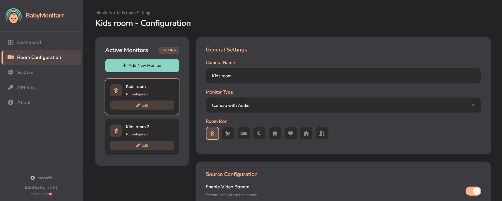
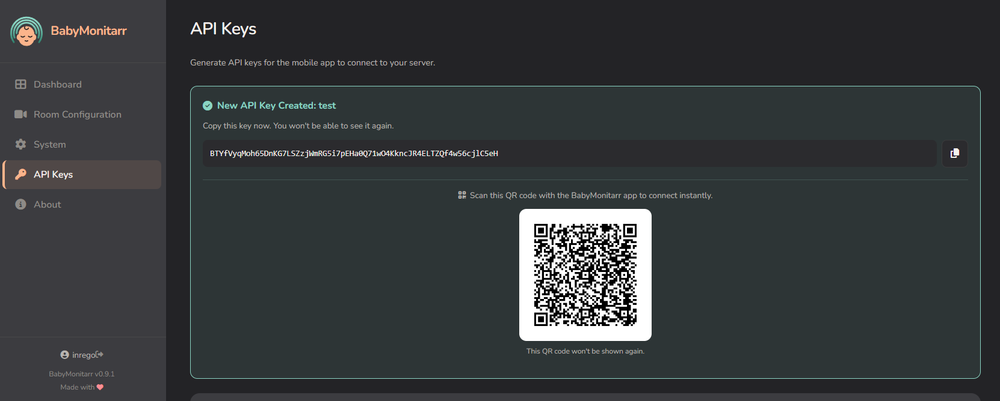

<p align="center">
  
</p>

<h1 align="center">BabyMonitarr</h1>

<p align="center">
  <strong>A self-hosted, real-time baby monitor for your IP cameras.</strong>
  <br />
  Stream audio and video from any RTSP camera or Google Nest device with near-zero latency — no cloud, no subscriptions.
</p>

<p align="center">
  <a href="#quick-start">Quick Start</a> •
  <a href="#features">Features</a> •
  <a href="#screenshots">Screenshots</a> •
  <a href="#mobile-app">Mobile App</a> •
  <a href="#tech-stack">Tech Stack</a> •
  <a href="#contributing">Contributing</a>
</p>

---

## Why BabyMonitarr?

Most baby monitors are expensive proprietary hardware, cloud-dependent apps with monthly fees, or laggy phone-based solutions. If you already have an IP camera (or a Google Nest), you shouldn't need any of that.

BabyMonitarr turns your existing cameras into a low-latency, privacy-first baby monitor. It uses **WebRTC** for near-instant streaming — the same technology behind video calls — so audio reaches you in milliseconds, not seconds.

**No data leaves your network. No accounts required. No subscriptions.**

## Features

- **Multi-Room Monitoring** — Set up as many rooms as you need with individual camera and audio settings
- **Low-Latency Audio & Video** — WebRTC streaming with Opus audio and video codec passthrough (H264, H265, VP8)
- **Sound Detection & Alerts** — Configurable audio threshold alerts with cooldown
- **RTSP & Google Nest Support** — Works with any RTSP camera or Google Nest device via the Smart Device Management API
- **Docker Ready** — One container, one volume, up and running in under a minute
- **Privacy First** — Fully self-hosted with a local SQLite database

## Screenshots

| Dashboard | Room Configuration | App Pairing |
|:-:|:-:|:-:|
|  |  |  |

## Quick Start

### Docker

Create an `appsettings.json` with your WebRTC settings:

```json
{
  "WebRtc": {
    "AdvertisedAddress": "192.168.0.100",
    "RtpPortRange": { "Start": 40000, "End": 40099, "Shuffle": true }
  }
}
```

> Replace `192.168.0.100` with the IP/hostname your clients will reach the server at.

```bash
docker run -d \
  --name babymonitarr \
  -p 8080:8080 \
  -p 40000-40099:40000-40099/udp \
  -v babymonitarr-data:/app/data \
  -v ./appsettings.json:/app/appsettings.Production.json:ro \
  ghcr.io/inrego/babymonitarr:latest
```

Then open [http://localhost:8080](http://localhost:8080) in your browser.

### Docker Compose

```yaml
services:
  babymonitarr:
    image: ghcr.io/inrego/babymonitarr:latest
    container_name: babymonitarr
    ports:
      - "8080:8080"
      - "40000-40099:40000-40099/udp" # WebRTC media
    environment:
      - WebRtc__AdvertisedAddress=192.168.0.100 # IP/hostname clients reach the server at
      - WebRtc__RtpPortRange__Start=40000
      - WebRtc__RtpPortRange__End=40099
      - WebRtc__RtpPortRange__Shuffle=true
    volumes:
      - babymonitarr-data:/app/data
    restart: unless-stopped

volumes:
  babymonitarr-data:
```

> Replace `192.168.0.100` with the IP/hostname your clients will reach the server at.
> If running behind a reverse proxy, see [Reverse Proxy Setup](docs/REVERSE_PROXY.md) and consider using `WebRtc__InferAdvertisedAddressFromForwardedHost=true` instead.

All monitor settings are managed through the web UI — no config files to edit beyond the WebRTC basics above.

## Mobile App

BabyMonitarr is designed to be used with the companion mobile app:

**[BabyMonitarr.App](https://github.com/Inrego/BabyMonitarr.App)** — A mobile client that connects to your BabyMonitarr server for on-the-go monitoring with push notifications.

Pair the app by generating an API key in the web UI (API Keys page) and scanning the QR code.

## Tech Stack

| Component | Technology |
|-----------|-----------|
| Backend | **ASP.NET Core 9** |
| Streaming | **WebRTC** (near-zero latency via peer-to-peer) |
| Signaling | SignalR (WebSocket) |
| Media | FFmpeg, SIPSorcery |
| Database | SQLite |

## Further Documentation

| Topic | Description |
|-------|-------------|
| [Configuration](docs/CONFIGURATION.md) | Environment variables, appsettings, WebRTC tuning, FFmpeg diagnostics |
| [Reverse Proxy Setup](docs/REVERSE_PROXY.md) | Running behind Caddy, Nginx, or Traefik with WebRTC |
| [Google Nest Setup](docs/GOOGLE_NEST_SETUP.md) | OAuth setup for the Smart Device Management API |
| [Authentication](docs/AUTHENTICATION.md) | Local auth, proxy header auth (Authelia, Authentik), and OIDC |
| [Client Integration](docs/CLIENT_INTEGRATION.md) | SignalR hub protocol for building custom clients |

## Contributing

Contributions are welcome! Whether it's bug reports, feature requests, or pull requests — all help is appreciated.

1. Fork the repository
2. Create your feature branch (`git checkout -b feature/amazing-feature`)
3. Commit your changes (`git commit -m 'Add amazing feature'`)
4. Push to the branch (`git push origin feature/amazing-feature`)
5. Open a Pull Request

## Disclaimer

This project is 100% AI-written code. However, the author is an experienced developer — prompts were crafted with deliberate architectural decisions, not blind copy-paste.

## License

[MIT](LICENSE)
